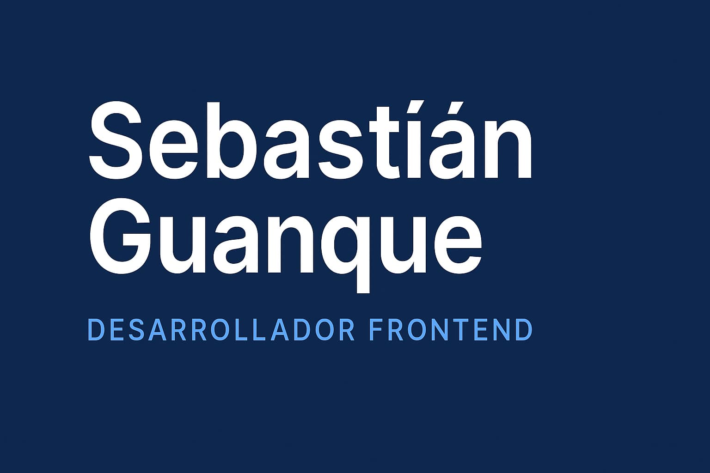
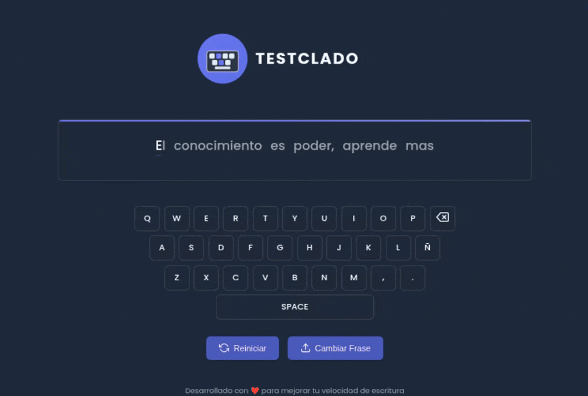
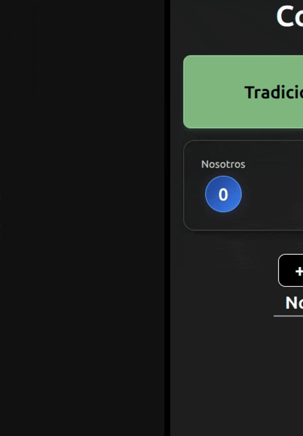

  

## 👋 Hola, soy Sebastián Guanque

¡Bienvenido/a a mi perfil de GitHub! Soy **Desarrollador Frontend** y vivo en **Neuquén, Argentina**.

Gracias a mi formación academica y un fuerte enfoque en el autoaprendizaje continuo, he creado un perfil profesional con experiencia práctica en **HTML, CSS y JavaScript**.

Mi objetivo es construir **experiencias web intuitivas y visualmente atractivas**. Busco innovar constantemente y encontrar soluciones.

---

## 🌟 Áreas de Interés

Estas son las áreas en las que me especializo y trabajo:

|                            |                            |
| :------------------------- | :------------------------- |
| 👨‍💻 **Desarrollo Frontend** | ♿ **Accesibilidad y SEO** |
| 📱 **Responsive Design**   | 🎨 **UI/UX Design**        |
| ✅ **Testing**             | 🚀 **Web Performance**     |

 

---

## 🛠️ Herramientas & Tecnologías

Estas son algunas herramientas y tecnologías con las que trabajo habitualmente:

|                                                                                                     |                                                                                                     |                                                                                                            |
| :-------------------------------------------------------------------------------------------------- | :-------------------------------------------------------------------------------------------------- | :--------------------------------------------------------------------------------------------------------- |
|   **HTML**    |   **CSS**       |   **JavaScript** |
|   **Vue.js** |   **Figma** |   **Git**              |

---

## 🚀 Mis Proyectos Destacados

Estos son algunos de los proyectos en los que estoy trabajado.

---

### ⌨️ TESTCLADO - Tester de Velocidad de Escritura

Una aplicación web interactiva diseñada para que los usuarios puedan mejorar y medir su velocidad de escritura. Proporciona estadísticas en tiempo real como palabras por minuto y precisión.

  

**Tecnologías:** HTML, CSS, JavaScript

**Demo:** [Ver Demo](https://sebastianguanque.dev.ar/testclado/)
**Repositorio:** [Código en GitHub](https://github.com/sebastianguanque/testclado)

---

### 🃏 Contador de Truco

Un contador de puntos digital para el popular juego de cartas argentino, el Truco. Ofrece un contador tradicional con fósforos, y uno digital con números para adaptarse a las preferencias del usuario, buscando mejorar la experiencia de seguimiento del juego.

  

**Tecnologías:** HTML, CSS, JavaScript

**Demo:** [Ver Demo](https://sebastianguanque.dev.ar/contador-truco/)
**Repositorio:** [Código en GitHub](https://github.com/sebastianguanque/contador-truco)

 

**¡Explora más en mi perfil para ver todos mis proyectos!**

---

## 📬 Contáctame

Si tienes alguna pregunta, oportunidad de colaboración o simplemente quieres saludar, no dudes en contactarme:

 
&nbsp;&nbsp;&nbsp;  
    
&nbsp;&nbsp;&nbsp;       

